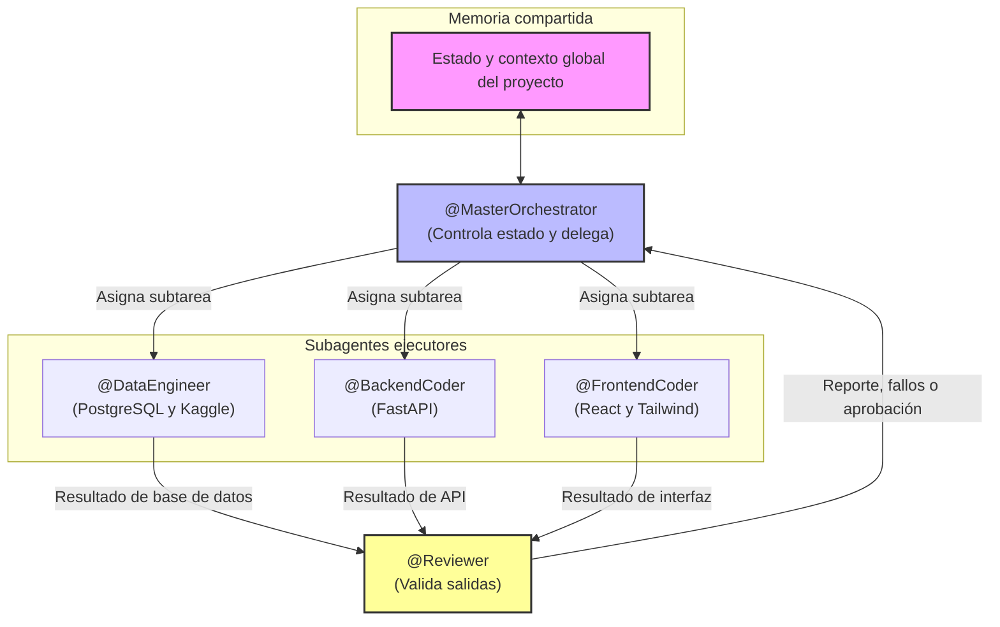

# Diagrama del Sistema Multiagente

> **Referencia canónica del grafo.** Este archivo se carga como instrucción global del harness a través de `instructions` en `opencode.json`, de modo que todos los agentes comparten la misma imagen topológica. El orquestador (Section 3 de `agents.md`) y los contratos de datos (Section 6) se derivan de este diagrama.

---

## Leyenda de nodos

| Nodo | Tipo | Rol en el grafo | Forma de acceso |
| --- | --- | --- | --- |
| `MC` | Memoria compartida | Estado y contexto global (colas, tareas, presupuesto, checkpoints). Fuente de verdad única. | Archivo `state/estado.json`, versionado bajo contrato `estado-v1`. |
| `MO` | Orquestador (`primary`) | Controla estado, descompone el objetivo, delega subtareas, evalúa reportes, gestiona reintentos y presupuesto. | Agente `master-orchestrator` de `opencode.json`. |
| `DE` | Ejecutor (`subagent`) | PostgreSQL (schema, migraciones, seeds) y datasets de Kaggle. | Agente `data-engineer`. |
| `BE` | Ejecutor (`subagent`) | API REST con FastAPI. | Agente `backend-coder`. |
| `FE` | Ejecutor (`subagent`) | Cliente web con React y Tailwind CSS. | Agente `frontend-coder`. |
| `REV` | Validador (`subagent`) | Entorno aislado Docker Compose: linters, builds y tests. Solo lectura de código. | Agente `reviewer`. |

## Leyenda de aristas

| Arista | Dirección | Contrato de datos | Significado |
| --- | --- | --- | --- |
| `MC <--> MO` | Bidireccional | `state/estado.json` (esquema `estado-v1`) | El orquestador lee y escribe el estado global; es la **única** conexión con la memoria compartida. |
| `MO --> DE/BE/FE` | Saliente | `TaskContract` (esquema `task-contract-v1`) | Asignación de subtarea con **entrada filtrada** (Context Windowing) y presupuesto. |
| `DE/BE/FE --> REV` | Saliente | `DeliverableContract` (esquema `deliverable-contract-v1`) | Resultado del ejecutor que entra en validación. |
| `REV --> MO` | Saliente | `ReviewReport` (esquema `review-report-v1`) | Reporte con veredicto APROBADO / RECHAZADO, checklist y evidencia. |

## Invariantes estructurales del grafo

1. **Topología centralizada en estrella.** No existen aristas directas entre ejecutores (DE-BE-FE) ni entre ejecutor y memoria. Toda comunicación lateral pasa por `MO`; el reviewer solo habla con `MO`.
2. **Un único punto de decisión.** El veredicto de `REV` no es ejecutable por sí mismo: `MO` decide reaprovechar, corregir o escalar.
3. **Bucle acotado.** Toda ruta `MO -> ejecutor -> REV -> MO` consume un intento y está limitada a 3 reintentos por subtarea (ver `agents.md` §7).
4. **Memoria versionada.** Cada escritura de `MO` sobre `MC` incrementa `schema_version` y registra `ultima_actualizacion`; los rollbacks se apoyan en este historial.