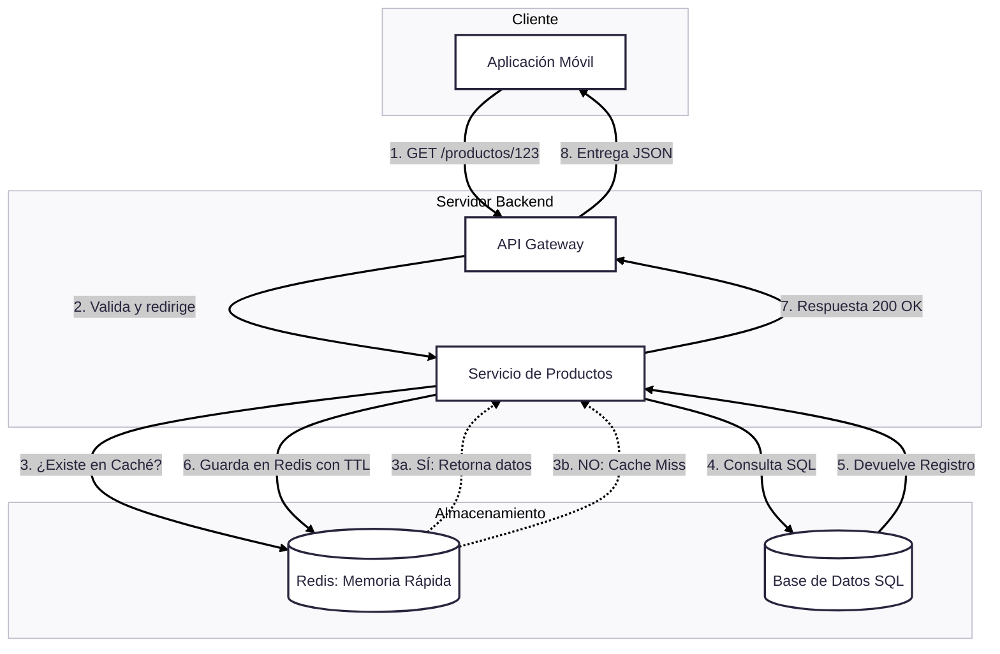

```mermaid
---
config:
  layout: dagre
  theme: redux
---

flowchart TB
subgraph Cliente["Cliente"]
A["Aplicación Móvil"]
end
subgraph ServidorBackend["Servidor Backend"]
B["API Gateway"]
D["Servicio de Productos"]
end
subgraph Almacenamiento["Almacenamiento"]
E[("Redis: Memoria Rápida")]
F[("Base de Datos SQL")]
end
A -- "1. GET /productos/123" --> B
B -- "2. Valida y redirige" --> D
D -- "3. ¿Existe en Caché?" --> E
E -. "3a. SÍ: Retorna datos" .-> D
E -. "3b. NO: Cache Miss" .-> D
D -- "4. Consulta SQL" --> F
F -- "5. Devuelve Registro" --> D
D -- "6. Guarda en Redis con TTL" --> E
D -- "7. Respuesta 200 OK" --> B
B -- "8. Entrega JSON" --> A
```
